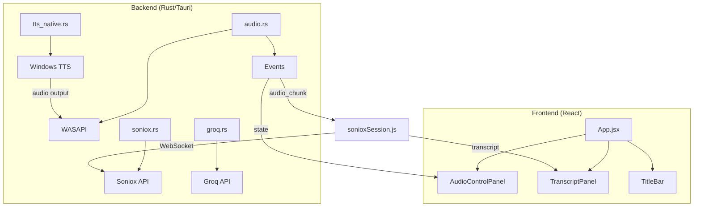
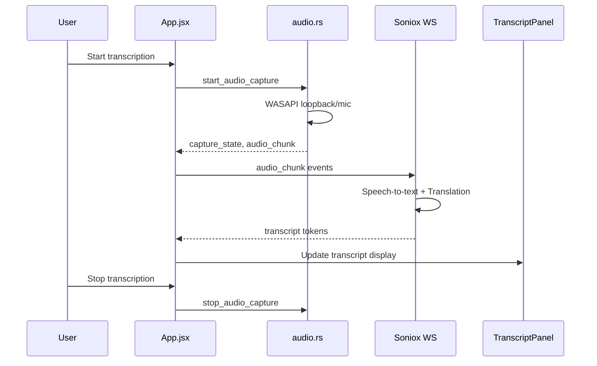

# sayvela

**Words are like sails** — Real-time voice translation and transcription app that helps you cross language barriers effortlessly.


## Overview

sayvela captures audio from two simultaneous sources — system loopback and microphone — performs real-time speech-to-text transcription with automatic language detection, translates the content, and optionally reads the translation back using text-to-speech.

## Features

| Feature | Description |
|---------|-------------|
| **Dual Audio Sources** | Capture from system speakers (loopback) and microphone simultaneously |
| **Real-time Transcription** | Speech-to-text using Soniox WebSocket streaming |
| **Intelligent Translation** | Automatic translation to your target language |
| **Speaker Diarization** | Automatic speaker identification and separation |
| **TTS Output** | Text-to-speech playback of mic translations |
| **AI Integration** | Groq API for question detection, ChatGPT for answers |
| **Content Protection** | Screenshot/screen-share protection for privacy |

## Architecture





## Prerequisites

- **OS**: Windows 10/11 (WASAPI audio capture)
- **Rust**: Latest stable
- **Node.js**: 18+
- **API Keys**:
  - `GROQ_API_KEY` — [Get from Groq Console](https://console.groq.com/)

## Installation

```bash
# Clone the repository
git clone <repository-url>
cd sayvela/desktop

# Install dependencies
npm install

# Create environment file
cp .env.example .env

# Add your API key to .env
# GROQ_API_KEY=your_key_here

# Start development server
npm run tauri dev
```

## Project Structure

```
desktop/
├── src/
│   ├── components/
│   │   ├── AudioControlPanel/
│   │   │   ├── AudioControlPanel.css
│   │   │   ├── LanguageControls.jsx
│   │   │   ├── SourceSection.jsx
│   │   │   ├── TtsSection.jsx
│   │   │   └── index.jsx
│   │   ├── TitleBar/
│   │   │   ├── Icons.jsx
│   │   │   ├── TitleBar.css
│   │   │   └── index.jsx
│   │   └── TranscriptPanel/
│   │       ├── TranscriptBubble.jsx
│   │       ├── TranscriptGrid.jsx
│   │       └── index.jsx
│   ├── hooks/
│   │   ├── useChatGPT.js
│   │   └── useSpeakerCheck.js
│   ├── transcript/
│   │   ├── sonioxSession.js
│   │   ├── transcriptUtils.js
│   │   └── useTranscript.js
│   ├── tts/
│   │   ├── ttsApi.js
│   │   └── useMicTranslationTts.js
│   ├── App.jsx
│   ├── App.css
│   ├── languages.js
│   └── main.jsx
├── src-tauri/
│   │   ├── chatgpt_inject_*.js
│   │   ├── groq.rs           # Groq API client
│   │   ├── lib.rs            # Tauri command handlers
│   │   ├── tts_native.rs     # Windows TTS
│   │   └── types.rs
│   ├── Cargo.toml
│   ├── tauri.conf.json
│   └── capabilities/default.json
├── package.json
├── vite.config.js
└── .env.example
```

## Usage

### 1. Configure System Audio (Loopback)
- Select a loopback device to capture system audio
- Set input languages (e.g., Japanese, English)
- Set output (translation) language (e.g., Vietnamese)
- Optionally add context to improve accuracy

### 2. Configure Microphone
- Select a microphone device
- Set input language (e.g., Vietnamese)
- Set output language (e.g., Japanese)
- Enable TTS to hear translations through speakers

### 3. Start
- Click **Start Transcription** to begin
- Click **Stop All** to stop

### 4. TTS Settings
- Select a voice matching your translation language
- Adjust speed, pitch, and volume
- Choose alternate output device if needed

## Supported Languages

| Code | Language |
|------|----------|
| `vi` | Vietnamese |
| `ja` | Japanese |
| `en` | English |
| `zh` | Chinese |
| `ko` | Korean |
| `fr` | French |
| `de` | German |
| `es` | Spanish |

Full list available in `src/languages.js`

## Tech Stack

### Frontend
- React 19
- Vite 7
- Tauri API v2

### Backend
- Tauri 2
- Rust (WASAPI, reqwest, serde)

### External Services
- [Soniox](https://soniox.com/) — Speech-to-text & translation
- [Groq](https://console.groq.com/) — Question detection

## Notes

- Audio capture is **Windows-only** (uses WASAPI)
- Content protection requires explicit enablement
- Context supports both JSON object and plain text formats

## Troubleshooting

### No audio devices visible
1. Click **Refresh Devices**
2. Verify audio drivers are installed

### Transcription not working
1. Check internet connectivity
2. Verify `GROQ_API_KEY` is set correctly in `.env`

### ChatGPT not responding
1. Verify internet connectivity
2. Check runtime logs for ChatGPT bridge command failures

## Contributing

1. Fork the repository
2. Create a feature branch
3. Make your changes
4. Submit a pull request

## License

MIT License — see LICENSE file for details.
