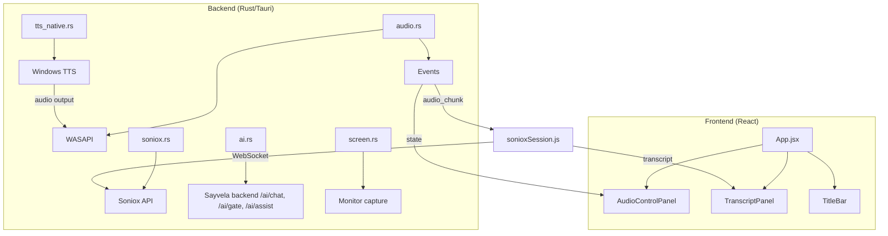
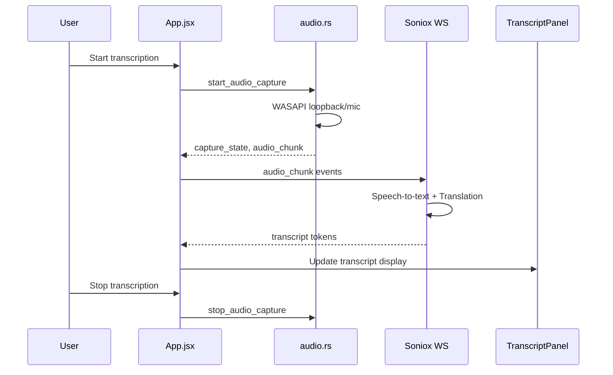

# sayvela

**Words are like sails** — Real-time voice translation and transcription app that helps you cross language barriers effortlessly.


## Overview

sayvela captures audio from two simultaneous sources — system loopback and microphone — performs real-time speech-to-text transcription with automatic language detection, translates the content, and optionally reads the translation back using text-to-speech.

## Features

| Feature | Description |
|---------|-------------|
| **Dual Audio Sources** | Capture from system speakers (loopback) and microphone simultaneously |
| **Real-time Transcription** | Speech-to-text using Soniox WebSocket streaming |
| **Intelligent Translation** | Automatic translation to your target language |
| **Speaker Diarization** | Automatic speaker identification and separation |
| **TTS Output** | Text-to-speech playback of mic translations |
| **AI Chat** | OpenAI-compatible chat streamed through the Sayvela backend |
| **Auto Assist** | A gate model watches the conversation; the main model opens answer/guide/code panels through tool calls |
| **Content Protection** | Screenshot/screen-share protection for privacy |

## Architecture





## Prerequisites

- **OS**: Windows 10/11 (WASAPI audio capture)
- **Rust**: Latest stable
- **Node.js**: 18+
- **Backend**: Sayvela backend configured with `AI_BASE_URL`, `AI_API_KEY`, `AI_MODEL`

## Installation

```bash
# Clone the repository
git clone <repository-url>
cd sayvela/desktop

# Install dependencies
npm install

# Create environment file
cp .env.example .env

# Start development server
npm run tauri dev
```

## Project Structure

```
desktop/
├── src/
│   ├── components/
│   │   ├── AssistFrame/      # assist panels opened by tool calls
│   │   ├── AudioControlPanel/
│   │   │   ├── AudioControlPanel.css
│   │   │   ├── AssistSection.jsx
│   │   │   ├── LanguageControls.jsx
│   │   │   ├── SettingsOutline.jsx
│   │   │   ├── SourceSection.jsx
│   │   │   ├── TtsSection.jsx
│   │   │   └── index.jsx
│   │   ├── TitleBar/         # nav tabs, assist controls, window controls
│   │   │   ├── AssistControls.jsx
│   │   │   ├── Icons.jsx
│   │   │   ├── NavTabs.jsx
│   │   │   ├── TitleBar.css
│   │   │   └── index.jsx
│   │   └── TranscriptPanel/
│   │       ├── TranscriptBubble.jsx
│   │       ├── TranscriptGrid.jsx
│   │       └── index.jsx
│   ├── hooks/
│   │   └── useAI.js
│   ├── transcript/
│   │   ├── sonioxSession.js
│   │   ├── transcriptUtils.js
│   │   └── useTranscript.js
│   ├── tts/
│   │   ├── ttsApi.js
│   │   └── useMicTranslationTts.js
│   ├── App.jsx
│   ├── App.css
│   ├── languages.js
│   └── main.jsx
├── src-tauri/
│   │   ├── ai.rs             # AI chat/assist stream client (backend proxy)
│   │   ├── screen.rs         # Monitor capture for assist screenshots
│   │   ├── lib.rs            # Tauri command handlers
│   │   ├── tts_native.rs     # Windows TTS
│   │   └── types.rs
│   ├── Cargo.toml
│   ├── tauri.conf.json
│   └── capabilities/default.json
├── package.json
├── vite.config.js
└── .env.example
```

## Usage

### 1. Configure System Audio (Loopback)
- Select a loopback device to capture system audio
- Set input languages (e.g., Japanese, English)
- Set output (translation) language (e.g., Vietnamese)
- Optionally add context to improve accuracy

### 2. Configure Microphone
- Select a microphone device
- Set input language (e.g., Vietnamese)
- Set output language (e.g., Japanese)
- Enable TTS to hear translations through speakers

### 3. Start
- Click **Start Transcription** to begin
- Click **Stop All** to stop

### 4. TTS Settings
- Select a voice matching your translation language
- Adjust speed, pitch, and volume
- Choose alternate output device if needed

## Supported Languages

| Code | Language |
|------|----------|
| `vi` | Vietnamese |
| `ja` | Japanese |
| `en` | English |
| `zh` | Chinese |
| `ko` | Korean |
| `fr` | French |
| `de` | German |
| `es` | Spanish |

Full list available in `src/languages.js`

## Tech Stack

### Frontend
- React 19
- Vite 7
- Tauri API v2

### Backend
- Tauri 2
- Rust (WASAPI, reqwest, serde)

### External Services
- [Soniox](https://soniox.com/) — Speech-to-text & translation
- OpenAI-compatible API (via backend proxy) — AI chat responses

## Layout

The home screen is a cockpit: the transcript takes the left 40% as one vertical
stream (newest turn at the bottom, enlarged while someone is speaking), and the
right 60% stacks the assist panels above the AI chat. Settings, contexts, sessions
and stats are full-width pages reached from the title bar nav; Settings carries a
sticky outline that tracks the section you scrolled to.

## Auto Assist

While a session is running, a small gate model reads the newest transcript lines every few seconds and answers 1/0.
On 1 — or when the global hotkey (`Ctrl+Shift+Space` by default) is pressed — the main vision model receives the
transcript plus a screenshot of the selected monitor and replies **only through tool calls**:

| Tool | Panel |
|---|---|
| `suggest_answer` | question, its translation and a suggested reply |
| `guide_steps` | goal plus "do A → get B" steps |
| `show_code` | code block with an explanation of the logic |
| `close_frame` / `finish` | closes one panel / ends the session |
| `list_frames` | answered by the backend from the panels the app reports |

Up to two panels are shown: the first takes the lower half of the AI Chat column, the second the lower half of the
transcript column. Plain text answers land in AI Chat with an `auto` badge. Pressing the hotkey again ends the session.

The shortcut is captured by low level Windows keyboard and mouse hooks rather than the global-shortcut plugin, so it can
be a side aware key (`ControlRight`), a combo (`Ctrl+Shift+Space`) or a mouse button (`MouseX1`, `Ctrl+MouseRight`).
Set it in Settings → AI Assist by pressing the keys you want.

Privacy: the screenshot is sent to the backend and on to the AI provider, and is never stored. It is skipped when the
image is unchanged or when **send a screenshot** is unchecked. With content protection on, the Sayvela window itself is
excluded from the capture.

## Notes

- Audio capture is **Windows-only** (uses WASAPI)
- Content protection requires explicit enablement
- Context supports both JSON object and plain text formats

## Troubleshooting

### No audio devices visible
1. Click **Refresh Devices**
2. Verify audio drivers are installed

### Transcription not working
1. Check internet connectivity
2. Verify Soniox backend access is available

### AI chat not responding
1. Verify internet connectivity
2. Check backend `AI_*` env vars and runtime logs for `ai_start_stream` failures

### Auto Assist never triggers
1. A session must be running — the loop starts with the recorder
2. Enable **AI Assist → let the gate model watch the conversation**, or press the hotkey
3. The gate only runs when a new final transcript line arrived since the last tick
4. Check backend `AI_GATE_MODEL` and runtime logs for `ai_gate` failures

## Contributing

1. Fork the repository
2. Create a feature branch
3. Make your changes
4. Submit a pull request

## License

MIT License — see LICENSE file for details.
